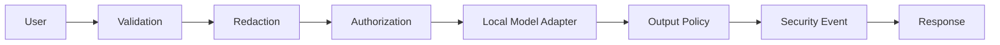

# AI Security Testing Lab

A defensive security gateway for LLM-enabled applications. The project demonstrates controls that application security teams can place around AI features before user content reaches a model and before model output reaches a user.

## Security controls

- Input size and shape validation
- Sensitive-data redaction before model processing
- Explicit tool allowlisting with default deny
- Output filtering for secret-like values
- Security event identifiers without raw prompt logging
- Deterministic local model adapter so no API key is required
- Automated security regression tests
- Threat model and production hardening guidance

## Architecture



## Run

```bash
python -m venv .venv
source .venv/bin/activate
pip install -r requirements.txt
uvicorn app.main:app --reload
```

Windows PowerShell:

```powershell
.venv\Scripts\Activate.ps1
pip install -r requirements.txt
uvicorn app.main:app --reload
```

Open `http://127.0.0.1:8000/docs`.

## Example

```bash
curl -X POST http://127.0.0.1:8000/chat \
  -H "Content-Type: application/json" \
  -d '{"prompt":"Explain least privilege in two sentences.","requested_tool":"knowledge_search"}'
```

## Security regression tests

```bash
pytest -q
```

The tests verify validation, redaction, authorization, output handling, and API behavior without targeting any external AI service.

## Production extensions

A production version would add identity-aware retrieval authorization, rate limiting, model-specific evaluation datasets, provenance controls, external secret management, SIEM integration, and human approval for high-impact actions.

See [docs/THREAT-MODEL.md](docs/THREAT-MODEL.md).
